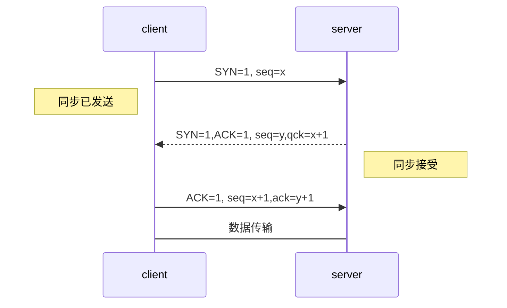
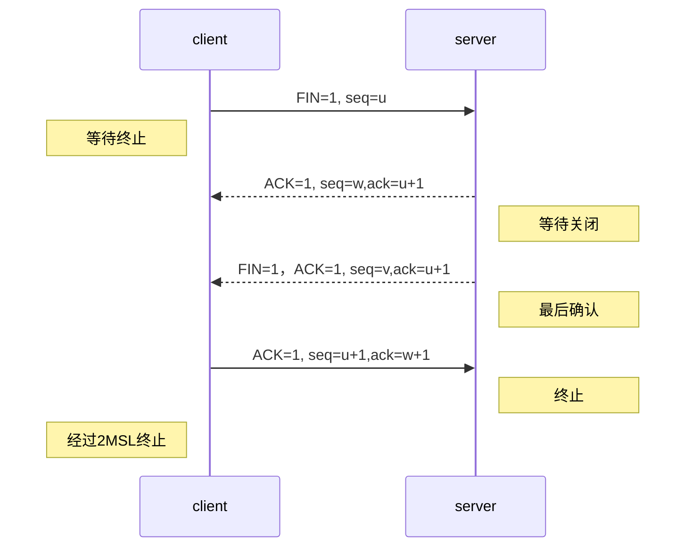

## **UDP 和TCP的区别：**

|  |  UDP|TCP  |
|--|--|--|
|  是否连接|  面向非连接|面向连接（三握事挥）|
|传输可靠性|不可靠|可靠|
|应用场合|传输少量数据|大量数据|
|速度|快|慢|

UDP:直接发送数据包，服务端接收到就返回一个确认；
TCP:经过三次握手和四次挥手的过程，SYN：同步序列编号（Synchronize Sequence Numbers）

**补充：**
网络传输可分为三个层次：网络层、传输层和应用层。  
网络层：有IP协议、ICMP协议、ARP协议、RARP协议和BOOTP协议。  
传输层：有TCP协议与UDP协议。  
应用层：有FTP、HTTP、TELNET、SMTP、DNS等协议。

## **TCP三次握手和四次挥手：**

TCP结构组成：

相关字段：
|  字段|含义  |
|--|--|
| 序列号seq | 占4个字节，用来标记数据块的顺序 |
|确认号ack|占4个字节，期待收到对方下一个报文段的第一个数据字节的序号|
|确认ACK|占1位，仅当ACK=1时，确认号字段才有效;ACK=0时，确认号无效|
|同步SYN|连接建立时用于同步序号。当SYN=1，ACK=0时表示：这是一个连接请求报文段。若同意连接，则在响应报文段中使得SYN=1，ACK=1|
|终止FIN|用来释放一个连接。FIN=1表示：此报文段的发送方的数据已经发送完毕，并要求释放运输连接|

**三次握手：**

**四次挥手：**

<!--stackedit_data:
eyJoaXN0b3J5IjpbLTE4MTY2MTA4NThdfQ==
-->