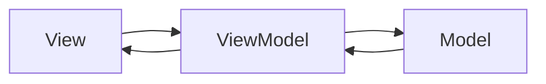

# 什么是MVVM模式


**View**: 视图DOM	
**ViewModel**: 通讯，观察者，监听View和Model的变化	
**Model**: 数据，接口，javascript对象

# Vue的基本应用
```javascript
<!DOCTYPE html>
<html lang="en">
<head>
	<script type='text/javascript' src='https://cdn.jsdelivr.net/npm/vue'></script>
	<meta charset="UTF-8">
	<title>MVVM</title>
</head>
<body>
	<div id='app'>
		<h1>{{title}}</h1>
		<ul>
			<li  v-for="user in users">{{user.name}}</li>
		</ul>
		<input type="text" v-model="name" id="name-input">
		<button v-on:click="addUser">添加用户</button>
	</div>
	<script type='text/javascript'>
	var model = {
		title : "vue.js的MVVM实现",
		users : [{name:"张良"},{name:"刘邦"},{name:"韩信"}]
	}

	var vue = new Vue({
		el : "#app",	//view
		data : model,	//model
		methods : {
			addUser : function(){
				this.users.push({name:""});
				this.name = ""
			}
		}
	});
	</script>
</body>
</html>
```


# 属性定义器介绍
Object.defineProperty(obj, prop, descriptor)
|参数/属性名|类型|描述|注解|
|--|--|--|--|
|obj|Object|目标对象|
|prop|String|目标属性| 
|descriptor:|Object|属性描述器|描述该属性的一些特征|
|-configurable|Boolean|是否可再配置|
|-enumerable|Boolean|是否可枚举|为false则属性非高亮不可for in
|-writable|Boolean|是否可写|
|-value|任意类型|属性的值
|-get|Function|取描述符|属性获得时的回调函数
|-set|Function|存描述符|设置属性时的回调函数

```javascript
<script>	
	var model = {
		titile : "test title"
	};
	var val = model.title;
	Object.defineProperty(model, "title", {
		get :function(){
			console.log("调用了getter");
			return val;
		},
		set :function(nval){
			console.log("调用了setter");
			val = nval;
		}
	})

	window.setTimeout(function(){
		model.title="尝试一下Object.defineProperty(obj, prop, descriptor)的用法";
		console.log(model.title);
	},1000)
</script>
```


# MVVM的实现
```javascript
var view = title;
var model = {
	titie: "test title"
};
reactiveMVVM(model,"title", model.title);

function reactiveMVVM(obj, key, val, customSetter){
	//getOwnPropertyDescriptor：获得obj对象的属性定义器
	var property = Object.getOwnPropertyDescriptor(obj, key);
    if (property && property.configurable === false) {
      return
    }

    // cater for pre-defined getter/setters
    var getter = property && property.get;
    var setter = property && property.set;

	Object.defineProperty(obj, key, {
      enumerable: true,
      configurable: true,
      get: function reactiveGetter () {
        var value = getter ? getter.call(obj) : val;
        // if (Dep.target) {
        //   dep.depend();
        //   if (childOb) {
        //     childOb.dep.depend();
        //     if (Array.isArray(value)) {
        //       dependArray(value);
        //     }
        //   }
        //}
        return value
      },
      set: function reactiveSetter (newVal) {
        var value = getter ? getter.call(obj) : val;
        /* eslint-disable no-self-compare */
        if (newVal === value || (newVal !== newVal && value !== value)) {
          return     //如果值没有改变就不通知视图
        }
        /* eslint-enable no-self-compare */
        if (customSetter) {//客户自定义方法
          customSetter();
        }
        // #7981: for accessor properties without setter
        if (getter && !setter) { return }
        if (setter) {
          setter.call(obj, newVal);
        } else {
          val = newVal;
        }
        view.innerText = val;
        // childOb = !shallow && observe(newVal);//wacther
        // dep.notify();
      }
    });
}
```


<!--stackedit_data:
eyJoaXN0b3J5IjpbOTE0NDk2NzM3XX0=
-->