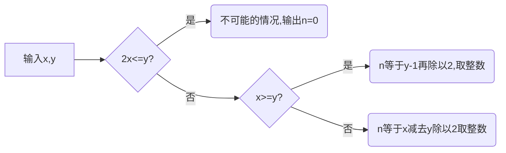

## 1.猜数游戏（百度前端笔试）

**题目描述：**

> 妞妞和牛牛在玩一个猜数字游戏，妞妞心理想两个不同的正整数，把这两个数的和y告诉牛牛； 妞妞声称这两个数不超过x,让牛牛猜这两个数是多少？
> 牛牛每猜一次，妞妞会告诉他对不对，对了就停止，错了就继续；
> 为了增加难度，妞妞会故意误报x的大小，如果牛牛判断出妞妞说的x是错的，就会直接询问答案。 牛牛最坏的情况下要才多少次才能才出正确的结果？

**输入描述：**
> $$ 两个整数 x, y;	(1<=x, y<=10^{14}) $$

**输出描述：**
> n  , 表示牛牛在最坏情况下猜测次数

**示例：**

>     输入：7     10
>     输出：2

**解答思路：**

**代码实现：**

    

<!--stackedit_data:
eyJoaXN0b3J5IjpbMTcwMTkxMzk0NF19
-->